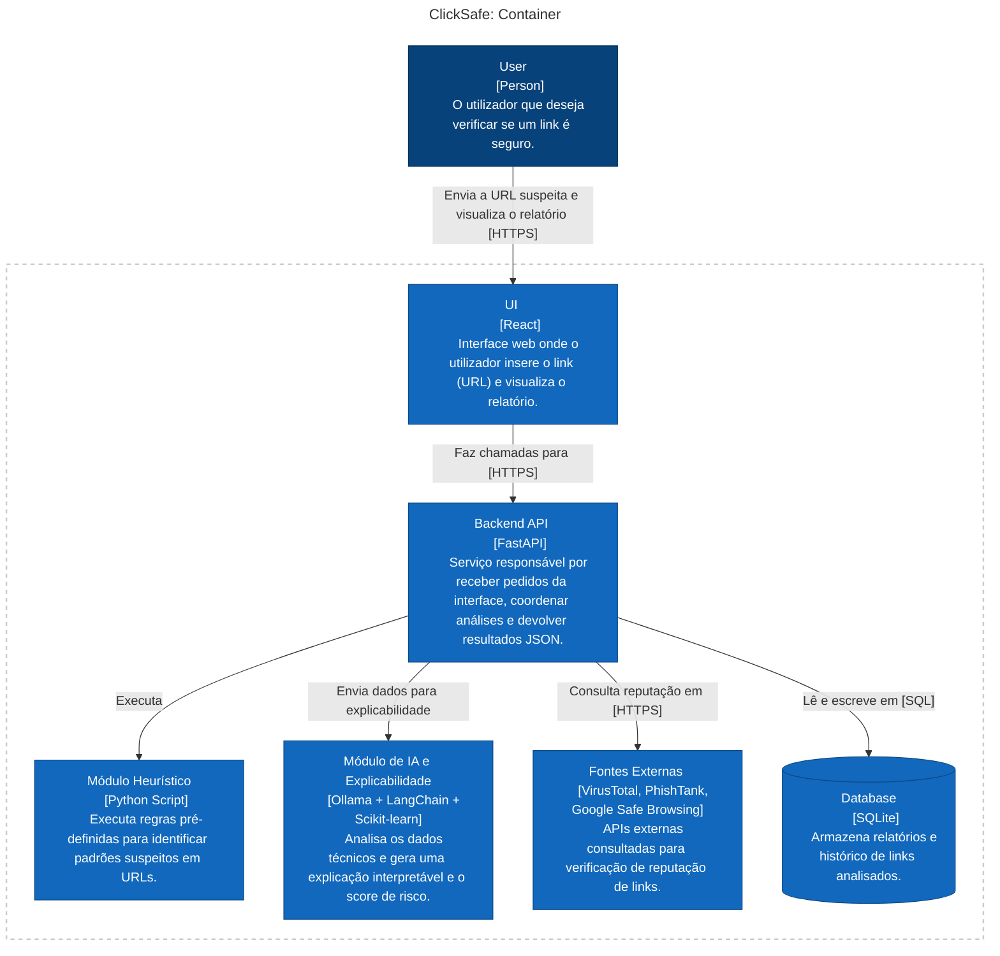

```mermaid
---
config:
  layout: fixed
title: 'ClickSafe: Container'
---
flowchart TD
 subgraph clicksafe-service["ClickSafe"]
        UI["UI 
    [React]
    Interface web onde o utilizador insere o link (URL) e visualiza o relatório."]
    
        Backend["Backend API 
    [FastAPI]
    Serviço responsável por receber pedidos da interface, coordenar análises e devolver resultados JSON."]
    
        Heuristic["Módulo Heurístico
    [Python Script]
    Executa regras pré-definidas para identificar padrões suspeitos em URLs."]
    
        XAI["Módulo de IA e Explicabilidade
    [Ollama + LangChain + Scikit-learn]
    Analisa os dados técnicos e gera uma explicação interpretável e o score de risco."]
    
        Reputation["Fontes Externas 
    [VirusTotal, PhishTank, Google Safe Browsing]
    APIs externas consultadas para verificação de reputação de links."]
    
        DB[("Database
    [SQLite]
    Armazena relatórios e histórico de links analisados.")]
        
        UI -- "Faz chamadas para" [HTTPS] --> Backend
        Backend -- "Consulta reputação em" [HTTPS] --> Reputation
        Backend -- "Executa" --> Heuristic
        Backend -- "Envia dados para explicabilidade" --> XAI
        Backend -- "Lê e escreve em" [SQL] --> DB
  end

    User["User
    [Person]
    O utilizador que deseja verificar se um link é seguro."]
    User -- "Envia a URL suspeita e visualiza o relatório" [HTTPS] --> UI

    class User person
    class UI,Backend,Heuristic,XAI,Reputation,DB container
    
    classDef container fill:#1168bd,stroke:#0b4884,color:#ffffff
    classDef person fill:#08427b,stroke:#052e56,color:#ffffff
    style clicksafe-service fill:none,stroke:#CCC,stroke-width:2px,color:#fff,stroke-dasharray: 5 5
```