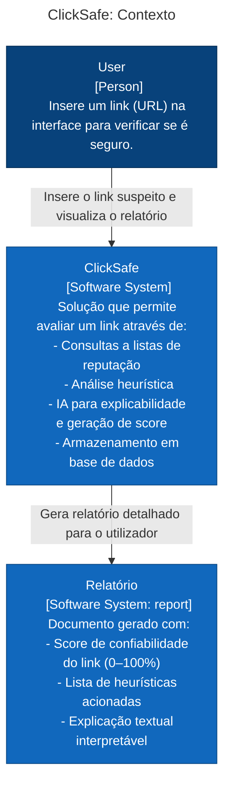

```mermaid
---
config:
  layout: fixed
title: 'ClickSafe: Contexto'
---
flowchart TD
    User["User
    [Person]
    Insere um link (URL) na interface para verificar se é seguro."]
    
    ClickSafe["ClickSafe
    [Software System]
    Solução que permite avaliar um link através de:
    - Consultas a listas de reputação
    - Análise heurística
    - IA para explicabilidade e geração de score
    - Armazenamento em base de dados"]
    
    Report["Relatório
    [Software System: report]
    Documento gerado com:
    - Score de confiabilidade do link (0–100%)
    - Lista de heurísticas acionadas
    - Explicação textual interpretável"]

    User -- "Insere o link suspeito e visualiza o relatório" --> ClickSafe
    ClickSafe -- "Gera relatório detalhado para o utilizador" --> Report

    class User person
    class ClickSafe,Report system
    
    classDef person fill:#08427b,stroke:#052e56,color:#ffffff
    classDef system fill:#1168bd,stroke:#0b4884,color:#ffffff
```