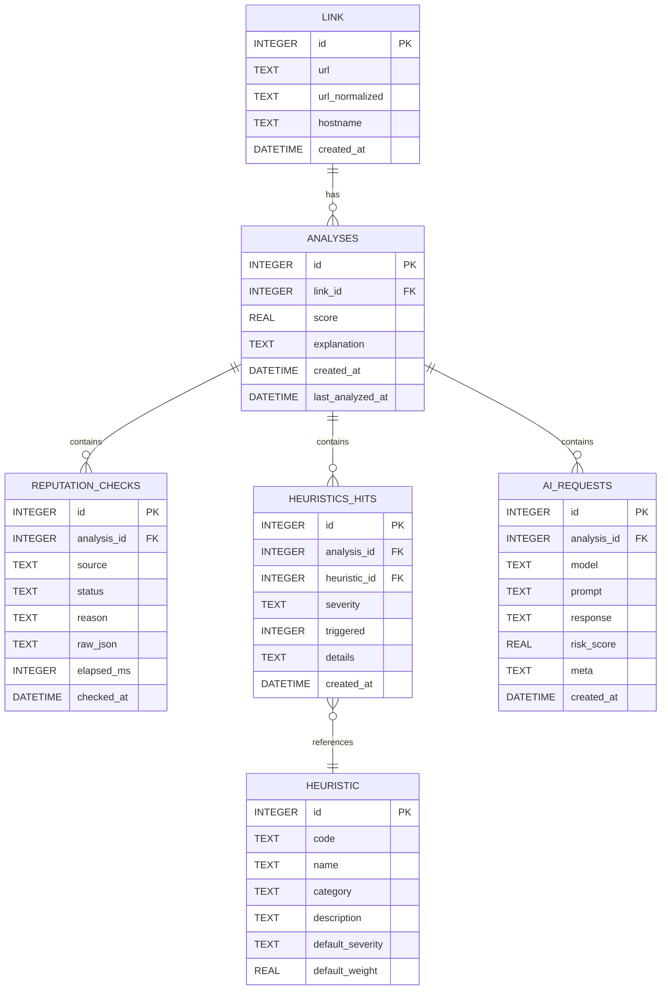

```mermaid
erDiagram
    LINK ||--o{ ANALYSES : has
    ANALYSES ||--o{ REPUTATION_CHECKS : contains
    ANALYSES ||--o{ HEURISTICS_HITS : contains
    ANALYSES ||--o{ AI_REQUESTS : contains
    HEURISTICS_HITS }o--|| HEURISTIC : references

    LINK {
      INTEGER id PK
      TEXT url
      TEXT url_normalized
      TEXT hostname
      DATETIME created_at
    }
    ANALYSES {
      INTEGER id PK
      INTEGER link_id FK
      REAL score
      TEXT explanation
      DATETIME created_at
      DATETIME last_analyzed_at
    }
    REPUTATION_CHECKS {
      INTEGER id PK
      INTEGER analysis_id FK
      TEXT source
      TEXT status
      TEXT reason
      TEXT raw_json
      INTEGER elapsed_ms
      DATETIME checked_at
    }
    HEURISTIC {
      INTEGER id PK
      TEXT code
      TEXT name
      TEXT category
      TEXT description
      TEXT default_severity
      REAL default_weight
    }
    HEURISTICS_HITS {
      INTEGER id PK
      INTEGER analysis_id FK
      INTEGER heuristic_id FK
      TEXT severity
      INTEGER triggered
      TEXT details
      DATETIME created_at
    }
    AI_REQUESTS {
      INTEGER id PK
      INTEGER analysis_id FK
      TEXT model
      TEXT prompt
      TEXT response
      REAL risk_score
      TEXT meta
      DATETIME created_at
    }
```
